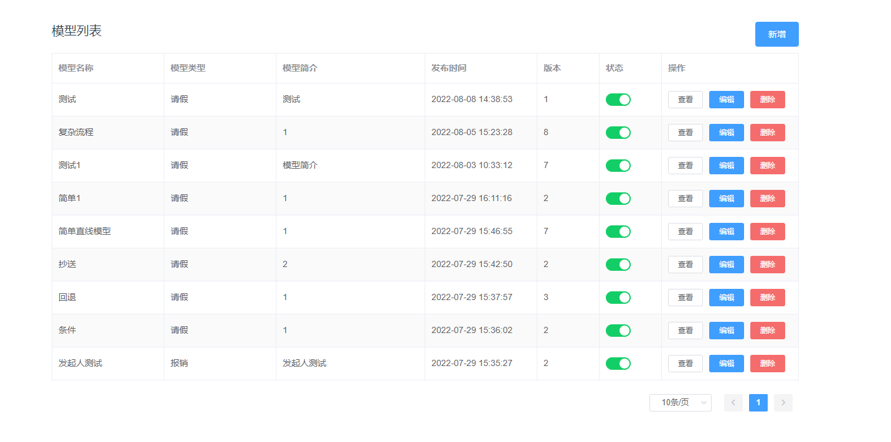
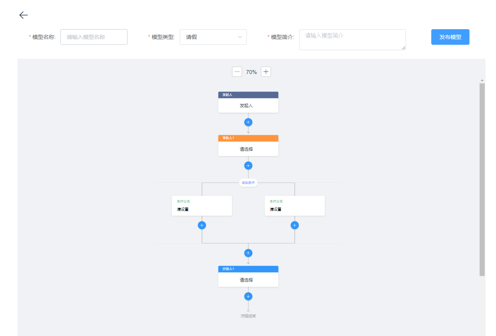

# flow-web
Vue2 + ElementUI + Axios   flowable 仿钉钉自定义流程，web组件

# 仿钉钉自定义流程文档

## 效果图



## 功能说明
主要功能:审批流的新建，流程列表展示，审批历史的展示相关等功能<br/>
1.支持设置添加审核人,抄送人,条件节点 <br/>
2.支持节点属性设置, 条件节点属性设置功能(节点名称, 节点属性; 节点人员选择, 类监听, 回签或签等功能)<br/>
2.支持审批流程的新建,编辑,回退,驳回,拒绝,加签等功能<br/>
3.支持审批历史展示, 并且可以通过前端插槽slot方式去自定义审批历史的展示<br/>

# 后端地址
https://github.com/figo003/flowpath.git


## 使用环境
Vue2 + ElementUI + Axios 

## 使用方法

1.通过 git clone 引入
```javaScript
git clone https://gitlab.sinopharm-bio.com/common/flowable-web.git
 
将DrawFlow 文件夹放在相应的项目文件中
```

2.在需要的地方引入，例如全局引入 (main.js)
```javaScript
import DrawFlow from "./components/DrawFlow";

// import DrawFlow from "draw-flow-chart"
// import "draw-flow-chart/draw-flow-chart.css";

Vue.use(DrawFlow);
```

3.在相应的需要的页面进行引入
```javaScript
<DrawFlowList :isShowCheck="isShowCheck" :params ="params"/>
```

### Attributes 
| 参数       | 说明     | 类型       | 可选值 | 默认值 |
|------------|--------|------------|--------|--------|
| isShowCheck| 是否显示审核历史 | Boolean| -- |--      |
| isCustomcheck| 是否自定义审核历史展示 | Boolean| -- |--      |
| params     | 参数用来获取审核历史的数据|Object|--|--  |


params说明

| 参数       | 说明     | 类型       | 可选值 | 默认值 |
|------------|--------|------------|--------|--------|
| taskId| 任务id| String| --     | --     |
| processInstanceId| 流程id| String| --     | --     |
| deployId| 发布id | String| --     | --     |


## 注意事项
由于组件内部跟后端有接口交互，如果需要项目运行成功，需要把后端的服务启动并可以正常访问，才能保证前端页面正常展示

前端代码中请求数据方式为：
```javaScript
axios.get(`/flowable/definition/categoryList`).then(res => {...})
```

## 举例使用

## 第一种：需要展示流程图列表，并且可以新增流程图，直接用下面的代码引入即可
```javaScript
<DrawFlowList/>
```
## 第二种：需要展示流程图，并且展示审核记录（需要传入相应的参数）
```javaScript
<DrawFlowList :isShowCheck="isShowCheck" :params ="params" :isCustomcheck="isCustomcheck">
    {/* 自定义插槽的内容， 注意：最外层的div需要加上slot="checkHistory" */}
    <div slot="checkHistory">
        ...自定义的dom结构
    </div>
</DrawFlowList>

data() {
    return {
      isCustomcheck: true // 是否展示自定义审核历史，如果值为true的话，则会展示自定义的审核历史情况，如果值为false，则展示组件基本的审核历史情况
      isShowCheck: true, // 是否展示审核，这个必须要写 true
      params: {
          taskId:'f4898485-1745-11ef-aba8-808897535054',
          processInstanceId:'b83e2fee-1745-11ef-aba8-808897535054',
          deployId:'a5b5c59a-1745-11ef-aba8-808897535054'
      }
    };
  },
```


# 交流群~~秋秋：
993911824<br>
开源不易，感谢支持一杯咖啡,您的支持才是我前进的动力 <br>

